### WELCOME TO MY PAGE 👋👋👋

My name is **Lê Minh Hùng**. I am an **Artificial Intelligence student at FPT University Da Nang**.  
I am interested in **Medical AI, Computer Vision, 3D Vision, Natural Language Processing, Large Language Model Systems, AGI Reasoning, and Autonomous Driving**. 

## 📫 How to reach me:

## 🚀 My Repositories

> Each card contains a curated project description. Language, stars and forks are refreshed automatically by GitHub Actions.

<table>
  <tr>
    <td width="50%" valign="top">
      <a href="https://github.com/hungle2006/Gold58-ConvNeXt2.5D">
        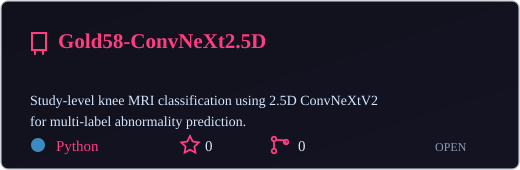
      </a>
    </td>
    <td width="50%" valign="top">
      <a href="https://github.com/hungle2006/knee-detection">
        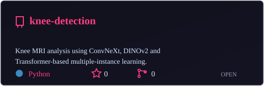
      </a>
    </td>
  </tr>
  <tr>
    <td width="50%" valign="top">
      <a href="https://github.com/hungle2006/BrainModel">
        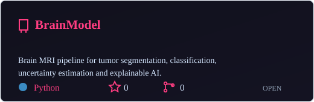
      </a>
    </td>
    <td width="50%" valign="top">
      
    </td>
  </tr>
  <tr>
    <td width="50%" valign="top">
      <a href="https://github.com/hungle2006/Diabetes-AI">
        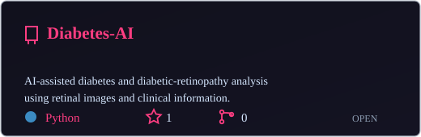
      </a>
    </td>
    <td width="50%" valign="top">
      
    </td>
  </tr>
  <tr>
    <td width="50%" valign="top">
      <a href="https://github.com/hungle2006/Deep-Image-Retrieval-using-DINOv2-OpenCLIP-ConvNeXt-and-LightGlue">
        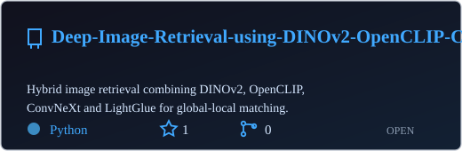
      </a>
    </td>
    <td width="50%" valign="top">
      <a href="https://github.com/hungle2006/anomaly_3branch">
        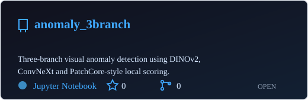
      </a>
    </td>
  </tr>
  <tr>
    <td width="50%" valign="top">
      <a href="https://github.com/hungle2006/Leaf_Disease">
        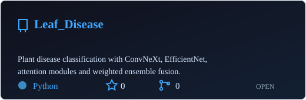
      </a>
    </td>
    <td width="50%" valign="top">
      <a href="https://github.com/hungle2006/OmniGS">
        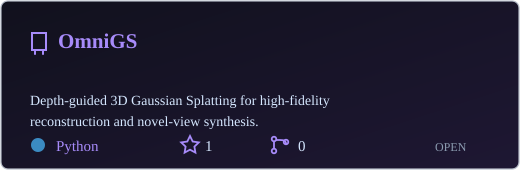
      </a>
    </td>
  </tr>
  <tr>
    <td width="50%" valign="top">
      <a href="https://github.com/hungle2006/Mip-Splatting-Fine-tuning">
        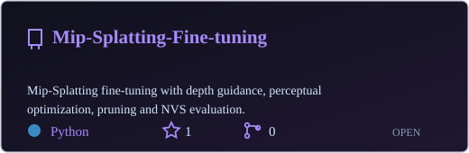
      </a>
    </td>
    <td width="50%" valign="top">
      <a href="https://github.com/hungle2006/gaussian-splatting-LPIPS-Fine-tuning">
        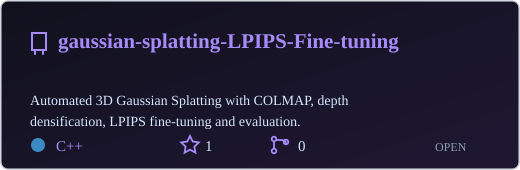
      </a>
    </td>
  </tr>
  <tr>
    <td width="50%" valign="top">
      
    </td>
    <td width="50%" valign="top">
      <a href="https://github.com/hungle2006/VietnameseMulti-scale-CNN">
        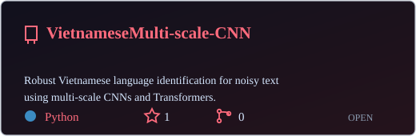
      </a>
    </td>
  </tr>
  <tr>
    <td width="50%" valign="top">
      <a href="https://github.com/hungle2006/lfm-serving">
        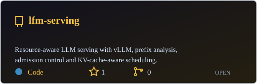
      </a>
    </td>
    <td width="50%" valign="top">
      <a href="https://github.com/hungle2006/speedLfmServing">
        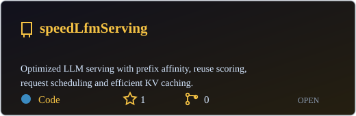
      </a>
    </td>
  </tr>
  <tr>
    <td width="50%" valign="top">
      <a href="https://github.com/hungle2006/ARC">
        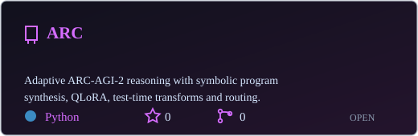
      </a>
    </td>
    <td width="50%" valign="top">
      <a href="https://github.com/hungle2006/Traffic_AV">
        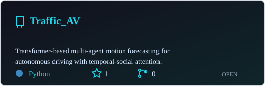
      </a>
    </td>
  </tr>
</table>

---

**Research · Build · Evaluate · Optimize · Reproduce**

